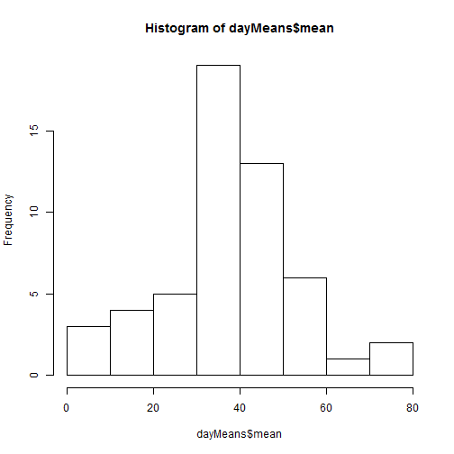
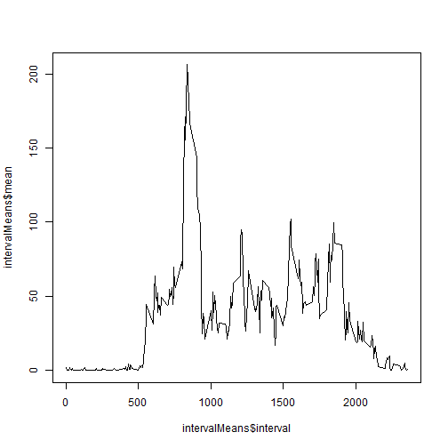
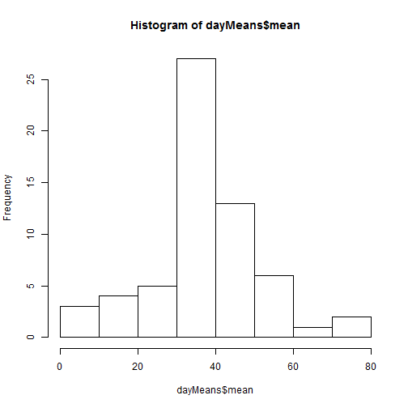
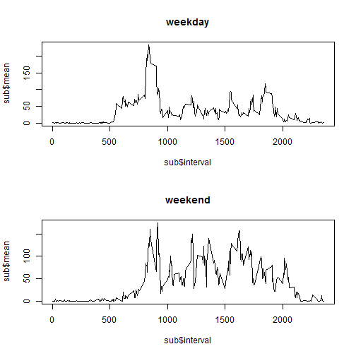

This report will walk through the steps outlined in the course description at :

[1] https://class.coursera.org/repdata-015/human_grading/view/courses/972599/assessments/3/submissions

## Download and preproccessing

We will start by pulling in the data from the assignment website:


```r
#First collected 6/3/15 at 9am. Collected when you ran this file :P
temp <- tempfile()
download.file("http://d396qusza40orc.cloudfront.net/repdata%2Fdata%2Factivity.zip",temp)
data <- read.csv(unz(temp,"activity.csv"))
unlink(temp)
```

Let's see what we got here:


```r
summary(data)
```

```
##      steps                date          interval     
##  Min.   :  0.00   2012-10-01:  288   Min.   :   0.0  
##  1st Qu.:  0.00   2012-10-02:  288   1st Qu.: 588.8  
##  Median :  0.00   2012-10-03:  288   Median :1177.5  
##  Mean   : 37.38   2012-10-04:  288   Mean   :1177.5  
##  3rd Qu.: 12.00   2012-10-05:  288   3rd Qu.:1766.2  
##  Max.   :806.00   2012-10-06:  288   Max.   :2355.0  
##  NA's   :2304     (Other)   :15840
```

```r
#I always want to see the top too, don't you?
head(data)
```

```
##   steps       date interval
## 1    NA 2012-10-01        0
## 2    NA 2012-10-01        5
## 3    NA 2012-10-01       10
## 4    NA 2012-10-01       15
## 5    NA 2012-10-01       20
## 6    NA 2012-10-01       25
```

So at this point I'm tempted to handle the NAs as part of the "preprocessing" but I suppose that's handled explicitly later in the assignment, so...

##What is the mean total number of steps taken per day?

1. calculate the steps per day
2. make a histogram of the steps per day totals
3. Calculate the mean and median of total steps per day

woot


```r
#this is easy with the data.table package
#install.packages(data.table)
library(data.table)
dt<-data.table(data)
dayMeans<-dt[,list(mean=mean(steps)),by=date]
hist(dayMeans$mean)
```

 

```r
# we still have na's :(
mean(dayMeans$mean, na.rm=TRUE)
```

```
## [1] 37.3826
```

```r
median(dayMeans$mean, na.rm=TRUE)
```

```
## [1] 37.37847
```

##What is the average daily activity patter?

1. Make a timeseries chart of the 5 minute interval and the average number of steps taken averaged across all days.
2. Which 5 minute interval has the highest average number of steps across all days?

seems an awful lot like the second group of instructions...


```r
intervalMeans<-dt[,list(mean=mean(steps,na.rm=TRUE)),by=interval]

plot(intervalMeans$mean~intervalMeans$interval,type="l")
```

 

## Imputing Missing Values

Note that there are a number of days/intervals where there are missing values (coded as NA). The presence of missing days may introduce bias into some calculations or summaries of the data.

1.Calculate and report the total number of missing values in the dataset (i.e. the total number of rows with NAs)

2.Devise a strategy for filling in all of the missing values in the dataset. The strategy does not need to be sophisticated. For example, you could use the mean/median for that day, or the mean for that 5-minute interval, etc.

3.Create a new dataset that is equal to the original dataset but with the missing data filled in.

4.Make a histogram of the total number of steps taken each day and Calculate and report the mean and median total number of steps taken per day. Do these values differ from the estimates from the first part of the assignment? What is the impact of imputing missing data on the estimates of the total daily number of steps?

1. Well, I'm fairly certain that we can see the number of NAs from the summary statement, let's be explicit:


```r
naCount<-nrow(data)-nrow(data[which(complete.cases(data)),])
```

2. Devise a strategy... we'll just put the median by interval. Seems easier...


```r
# I should be more clever than a for loop here... but, I wont be.
data.nafix <- data

for ( i in 1:length(data$steps)) {
    if (is.na(data$steps[i])) {
        #just means select this interval
        data.nafix$steps[i]<-intervalMeans[[which(intervalMeans$interval==data.nafix$interval[i]),2]]
    }
        
}
```

and that was 3 as well incidentally:
data.nafix is now our dataset with the missing data filled in

4.
you might not be surprised that we now have differend medians and means by day:


```r
dt<-data.table(data.nafix)
dayMeans<-dt[,list(mean=mean(steps)),by=date]
hist(dayMeans$mean)
```

 

```r
# we still have na's :(
mean(dayMeans$mean, na.rm=TRUE)
```

```
## [1] 37.3826
```

```r
median(dayMeans$mean, na.rm=TRUE)
```

```
## [1] 37.3826
```


for a bit of deeper insight, we could have avoided this impact of course by imputing by the daily
mean/median (somwhat unsurprisingly)


##Are there differences in activity patterns between weekdays and weekends?

--yes... har har

1.Create a new factor variable in the dataset with two levels - "weekday" and "weekend" indicating whether a given date is a weekday or weekend day.


```r
data$weekday <- ifelse(weekdays(as.Date(data$date))=="Saturday"|weekdays(as.Date(data$date))=="Sunday","weekend","weekday")
```

2. Now just split the earlier graph into two on the factor basically...


```r
dt<-data.table(data)

intervalMeans<-dt[,list(mean=mean(steps,na.rm=TRUE)),by=list(interval,weekday)]

#let just do this easy/inelegant
par(mfrow=c(2,1))
sub<-subset(intervalMeans,intervalMeans$weekday=="weekday")
plot(sub$mean~sub$interval,type="l",main="weekday")
sub<-subset(intervalMeans,intervalMeans$weekday=="weekend")
plot(sub$mean~sub$interval,type="l",main="weekend")
```

 
